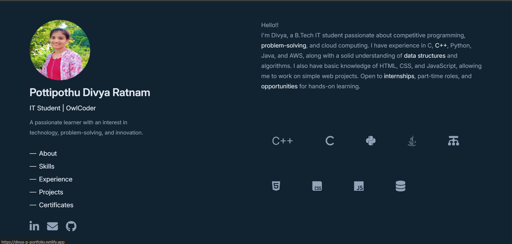

## 💼 Personal Portfolio
Welcome to my personal portfolio website! This site showcases my skills, projects, certifications, and contact information.
- 🔗 **Live Website**: [Portfolio](https://divya-p-portfolio.netlify.app)

---

## 🚀 Features

- 🌐 Responsive and clean UI
- 🛠️ Tech stack display and skills section
- 💻 Project showcase with GitHub/demo links
- 📬 Contact form and social links
- 🔒 Secure and optimized for performance

---

## 🛠️ Built With

- **HTML5**
- **CSS3**
- **JavaScript**
- **Netlify** – Deployment

---

## 📁 Folder Structure

-/portfolio
- index.html # Main HTML file
- styles.css # Custom CSS styling
- /public # Images, icons, etc.
- README.md # This file

---

## 📸 Screenshots

<!-- You can add image links or relative paths -->

---

## 🧠 What I Learned

- How to structure a personal portfolio from scratch
- Responsive design and layout techniques
- DOM manipulation using JavaScript
- Hosting with Netlify and basic SEO

---

## 👨‍💻 About Me

**Pottipothu Divya Ratnam**  
B.Tech in Information Technology  
RHCSA Certified | Python, C++, Java Enthusiast  

📫 **Connect with me**:  
- 🌐 [LinkedIn](https://www.linkedin.com/in/pottipothu-divya-ratnam-40b397260/)  
- 💻 [GitHub](https://github.com/Divyaratnam)  
- ✉️ [Email](mailto:divyapottipothu@gmail.com)

---
